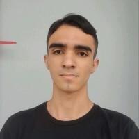
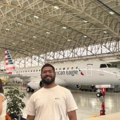

<h1>Undefined </h1>

<h1>🌱 AgriRS Lab – Website Oficial</h1>

O <strong>AgriRS Lab (Laboratório de Sensoriamento Remoto Agrícola – INPE)</strong> tem como objetivo centralizar
informações do laboratório, ampliando sua visibilidade e facilitando o acesso do público às
<strong>pesquisas, projetos e iniciativas em andamento</strong>.

<h2>📖 Sumário</h2>
<ul>
  <li><a href="#design-do-projeto">🎨 Design do Projeto</a></li>
  <li><a href="#tecnologias-previstas">🛠️ Tecnologias Previstas</a></li>
  <li><a href="#funcionalidades-planejadas">🚀 Funcionalidades Planejadas</a></li>
  <li>
    <a href="#requisitos">📑 Requisitos</a>
    <ul>
      <li><a href="#requisitos-funcionais">✅ Requisitos Funcionais</a></li>
      <li><a href="#requisitos-nao-funcionais">⚙️ Requisitos Não Funcionais</a></li>
    </ul>
  </li>
  <li><a href="#status-do-projeto">🚀 Status do Projeto</a></li>
  <li><a href="#integrantes">🧑 Integrantes</a></li>
  <li><a href="#licenca">📜 Licença</a></li>
  <li><a href="#links">Links 📎</a></li>
  <li><a href="#backlog-sprint-1">Backlog Sprint 1</a></li>
</ul>

<h2 id="design-do-projeto">🎨 Design do Projeto</h2>

O protótipo do website foi desenvolvido no <strong>Figma</strong>, com foco em
<strong>usabilidade</strong>, <strong>identidade visual</strong> e <strong>responsividade</strong>.
Ele servirá como base para o desenvolvimento do frontend.

🔗 <strong>Acesse o protótipo no Figma:</strong>
<a href="https://www.figma.com/files/team/1544516334617697082/project/444279865?fuid=1535458053608445462" target="_blank">Clique aqui</a>

<h3>Principais Características do Design</h3>
<ul>
  <li>Identidade visual alinhada ao propósito <strong>científico e institucional</strong> do laboratório.</li>
  <li>Layout <strong>responsivo</strong> (desktop e mobile).</li>
  <li>Estrutura de navegação <strong>intuitiva e organizada</strong>.</li>
  <li>Paleta de cores definida pelo grupo.</li>
  <li>Protótipos interativos que simulam a navegação final.</li>
</ul>

<h2 id="tecnologias-previstas">🛠️ Tecnologias Previstas</h2>

O desenvolvimento do site será feito utilizando tecnologias simples e eficientes para garantir
<strong>performance</strong> e <strong>acessibilidade</strong>:

<ul>
  <li><strong>Frontend:</strong>
     HTML,
     CSS,
     JavaScript
  </li>
  <li><strong>Design Responsivo:</strong> compatível com <strong>desktop</strong> e <strong>mobile</strong></li>
  <li><strong>Integração Multilíngue:</strong> suporte para <strong>Português</strong> e <strong>Inglês</strong></li>
</ul>

<h2 id="funcionalidades-planejadas">🚀 Funcionalidades Planejadas</h2>
<ul>
  <li><strong>Hero Banner</strong> e <strong>Carrossel de Destaques</strong></li>
  <li>Páginas Institucionais:
    <ul>
      <li><strong>Sobre</strong></li>
      <li><strong>Equipe</strong></li>
      <li><strong>Áreas de Atuação</strong></li>
    </ul>
  </li>
  <li><strong>Seção de Publicações e Notícias</strong></li>
  <li><strong>Página de Oportunidades</strong></li>
  <li><strong>Formulário de Contato</strong></li>
</ul>

<h2 id="requisitos">📑 Requisitos</h2>

<h3 id="requisitos-funcionais">✅ Requisitos Funcionais</h3>

<table>
  <thead>
    <tr>
      <th><strong>Código do Requisito</strong></th>
      <th><strong>Descrição</strong></th>
    </tr>
  </thead>
  <tbody>
    <tr>
      <td><strong>RF01</strong></td>
      <td><strong>Página Inicial (Home)</strong></td>
    </tr>
    <tr><td>RF01.1</td><td>Apresentar botões/menus de navegação para todas as páginas do site.</td></tr>
    <tr><td>RF01.2</td><td>Exibir seções em destaque (cards) com chamadas para notícias, projetos, publicações ou outras atualizações.</td></tr>
    <tr><td>RF01.3</td><td>Link para redes sociais e contato no final da página.</td></tr>
    <tr><td>RF01.4</td><td>Incluir colaboradores e financiadores (CNPq, CAPES, FAPESP).</td></tr>
    <tr>
      <td><strong>RF02</strong></td>
      <td><strong>Página Sobre o AgriRS</strong></td>
    </tr>
    <tr><td>RF02.1</td><td>Descrever o laboratório, objetivo e foco.</td></tr>
    <tr><td>RF02.2</td><td>Descrever as áreas de atuação com pequenos textos explicativos.</td></tr>
    <tr>
      <td><strong>RF03</strong></td>
      <td><strong>Página de Membros (Equipe)</strong></td>
    </tr>
    <tr><td>RF03.1</td><td>Listar todos os integrantes com nome, foto, função e breve descrição.</td></tr>
    <tr><td>RF03.2</td><td>Categorizar por tipo de membro (titulares, colaboradores, bolsistas, doutorado, mestrado e ex-membros).</td></tr>
    <tr><td>RF03.3</td><td>Ordenar cada categoria por ordem alfabética.</td></tr>
    <tr>
      <td><strong>RF04</strong></td>
      <td><strong>Página de Vagas (Oportunidades)</strong></td>
    </tr>
    <tr><td>RF04.1</td><td>Listar oportunidades como estágios, IC, pós-graduação e parcerias.</td></tr>
    <tr><td>RF04.2</td><td>Informar como se candidatar (documentos, critérios, prazos etc.).</td></tr>
    <tr>
      <td><strong>RF05</strong></td>
      <td><strong>Página de Projetos</strong></td>
    </tr>
    <tr><td>RF05.1</td><td>Listar projetos com título, resumo, ano de início, status e equipe envolvida.</td></tr>
    <tr><td>RF05.2</td><td>Permitir a inclusão de imagens ou links para mais informações.</td></tr>
    <tr>
      <td><strong>RF06</strong></td>
      <td><strong>Página de Notícias</strong></td>
    </tr>
    <tr><td>RF06.1</td><td>Publicar notícias com título, data, imagem e texto.</td></tr>
    <tr><td>RF06.2</td><td>Organizar notícias cronologicamente.</td></tr>
    <tr>
      <td><strong>RF07</strong></td>
      <td><strong>Página de Publicações</strong></td>
    </tr>
    <tr><td>RF07.1</td><td>Listar artigos, livros, capítulos etc., com título, revista, autores, ano e link.</td></tr>
    <tr><td>RF07.2</td><td>Campo de pesquisa por palavra-chave.</td></tr>
    <tr>
      <td><strong>RF08</strong></td>
      <td><strong>Página de Contato</strong></td>
    </tr>
    <tr><td>RF08.1</td><td>Formulário com nome, e-mail, assunto e mensagem, redirecionando para o e-mail do AgriRS Lab.</td></tr>
    <tr><td>RF08.2</td><td>Exibir informações institucionais (telefone, e-mail e endereço).</td></tr>
    <tr><td>RF08.3</td><td>Incluir links para redes sociais do laboratório.</td></tr>
    <tr><td>RF08.4</td><td>Incluir mapa de localização do laboratório dentro do INPE.</td></tr>
  </tbody>
</table>

<h3 id="requisitos-nao-funcionais">⚙️ Requisitos Não Funcionais</h3>

<table>
  <thead>
    <tr>
      <th><strong>Código do Requisito</strong></th>
      <th><strong>Descrição</strong></th>
    </tr>
  </thead>
  <tbody>
    <tr><td><strong>RNF01</strong></td><td>O site deve ser totalmente responsivo (celulares, tablets e computadores).</td></tr>
    <tr><td><strong>RNF02</strong></td><td>O conteúdo deve ser fácil de atualizar pelos integrantes do laboratório.</td></tr>
    <tr><td><strong>RNF03</strong></td><td>O site deve carregar rapidamente (imagens otimizadas).</td></tr>
    <tr><td><strong>RNF04</strong></td><td>Deve ter versão em português e inglês.</td></tr>
    <tr><td><strong>RNF05</strong></td><td>O site deve ser hospedado em serviço confiável e com domínio próprio.</td></tr>
    <tr><td><strong>RNF06</strong></td><td>Identidade visual a definir em conjunto com o laboratório.</td></tr>
  </tbody>
</table>

<h3 id="status-do-projeto">🚀 Status do Projeto</h3>

🔄 <strong>Em desenvolvimento</strong> – Acompanhe os commits para ver o progresso e as novas funcionalidades adicionadas.

<h2 id="integrantes">🧑 Integrantes</h2>

| Foto | Nome Completo                         | Papel          | LinkedIn                                                                 | GitHub                                  |
|------|---------------------------------------|---------------|--------------------------------------------------------------------------|-----------------------------------------|
|  | Pedro Augusto Gomes                   | Product Owner | [LinkedIn](https://www.linkedin.com/in/pedro-augusto-gomes)              | [GitHub](https://github.com/PedrinhoDBR) |
|  | Israel da Silva Lemes                 | Scrum Master  | [LinkedIn](https://www.linkedin.com/in/israel-lemes/)                    | [GitHub](https://github.com/Israelisl)   |
|  | João Paulo Lorena Dias da Silva       | Dev           | [LinkedIn](https://www.linkedin.com/in/jo%C3%A3o-lorena-056b95271)       | [GitHub](https://github.com/Jonnaes)     |
|  | Thales Cambraia Dias                  | Dev           | [LinkedIn](https://www.linkedin.com/in/thales-tcd/)                      | [GitHub](https://github.com/thalestcd)   |
|  | Marcus Vinicius Ribeiro do Nascimento | Dev           | [LinkedIn](https://www.linkedin.com/in/marcus-nascimento-50a0ba1b5)      | [GitHub](https://github.com/MarcusVRDN)  |
|  | Nicolas Bernardo Patricio de Assis    | Dev           | [LinkedIn](https://www.linkedin.com/in/n%C3%ADcolas-assis-495906274)     | [GitHub](https://github.com/Nickcolth)   |
|  | Ronaldo de Avila Ribeiro Junior       | Dev           | [LinkedIn](https://www.linkedin.com/in/ronaldo-de-avila-ribeiro-junior-653093238) | [GitHub](https://github.com/RonaldoAvilaa) |
| vazio | Rainan de Oliveira Reis               | Dev           | [LinkedIn](https://www.linkedin.com/in/rainan-reis-757384365/)           | [GitHub](https://github.com/RainanKaneka) |

<h2 id="licenca">📜 Licença</h2>

  Este projeto é de caráter <strong>acadêmico</strong> e <strong>institucional</strong>, 
  vinculado ao <strong>INPE</strong>.  
  Consulte as <strong>diretrizes do laboratório</strong> antes de reutilizar ou redistribuir este conteúdo.

<h1 id="links">Links 📎</h1>

<ul>
  <li>
    <strong>Trello:</strong>
    <a href="https://trello.com/invite/b/68d3438109f6162f0c66abaa/ATTI0981fc780064200aaab49d972b5ea751C1BC62D6/undefined-sprint-1" target="_blank">
      Acessar Trello
    </a>
  </li>
  <li>
    <strong>Figma:</strong>
    <a href="https://www.figma.com/files/team/1544516334617697082/project/444279865?fuid=1407439674361896360" target="_blank">
      Acessar Figma
    </a>
  </li>
</ul>

<h2 id="backlog-sprint-1">Backlog Sprint 1</h2>
  <table border="1" cellpadding="5" cellspacing="0">
    <thead>
      <tr>
        <th>ID</th>
        <th>Nome</th>
        <th>Pontos</th>
        <th>Responsáveis</th>
        <th>Status</th>
        <th>Link</th>
        <th>Requisitos atendidos</th>
      </tr>
    </thead>
    <tbody>
      <tr>
        <td>DD-001</td>
        <td>Verificar identidade visual</td>
        <td>3</td>
        <td>Rainan</td>
        <td>✔</td>
        <td></td>
        <td>RNF06</td>
      </tr>
      <tr>
        <td>DD-002</td>
        <td>Header/Footer</td>
        <td>3</td>
        <td>João</td>
        <td>✔</td>
        <td><a href="https://www.figma.com/design/2N7zSpm5xo2rUtcfgw2qbS/Tela-Inicio?node-id=0-1&p=f&t=SrGNEzFyTJh1DmLr-0">Link</a></td>
        <td>RF01.01</td>
      </tr>
      <tr>
        <td>DD-003</td>
        <td>Página inicial</td>
        <td>3</td>
        <td>Rainan</td>
        <td>✔</td>
        <td><a href="https://www.figma.com/design/2N7zSpm5xo2rUtcfgw2qbS/Tela-Inicio?node-id=0-1&p=f&t=SrGNEzFyTJh1DmLr-0">Link</a></td>
        <td>RF01</td>
      </tr>
      <tr>
        <td>DD-004</td>
        <td>Sobre o agriRS</td>
        <td>3</td>
        <td>João</td>
        <td>✔</td>
        <td><a href="https://www.figma.com/design/2N7zSpm5xo2rUtcfgw2qbS/Tela-Inicio?node-id=0-1&p=f&t=SrGNEzFyTJh1DmLr-0">Link</a></td>
        <td>RF02</td>
      </tr>
      <tr>
        <td>DD-005</td>
        <td>Membros</td>
        <td>3</td>
        <td>Thales</td>
        <td>✔</td>
        <td><a href="https://www.figma.com/design/2N7zSpm5xo2rUtcfgw2qbS/Tela-Inicio?node-id=0-1&p=f&t=SrGNEzFyTJh1DmLr-0">Link</a></td>
        <td>RF03</td>
      </tr>
      <tr>
        <td>DD-006</td>
        <td>Vagas</td>
        <td>3</td>
        <td>Nicolas</td>
        <td>✔</td>
        <td><a href="https://www.figma.com/design/2N7zSpm5xo2rUtcfgw2qbS/Tela-Inicio?node-id=0-1&p=f&t=SrGNEzFyTJh1DmLr-0">Link</a></td>
        <td>RF04</td>
      </tr>
      <tr>
        <td>DD-007</td>
        <td>Projetos</td>
        <td>3</td>
        <td>Israel</td>
        <td>✔</td>
        <td><a href="https://www.figma.com/design/2N7zSpm5xo2rUtcfgw2qbS/Tela-Inicio?node-id=0-1&p=f&t=SrGNEzFyTJh1DmLr-0">Link</a></td>
        <td>RF05</td>
      </tr>
      <tr>
        <td>DD-008</td>
        <td>Contato</td>
        <td>3</td>
        <td>Marcus</td>
        <td>✔</td>
        <td><a href="https://www.figma.com/design/2N7zSpm5xo2rUtcfgw2qbS/Tela-Inicio?node-id=0-1&p=f&t=SrGNEzFyTJh1DmLr-0">Link</a></td>
        <td>RF08</td>
      </tr>
      <tr>
        <td>DD-009</td>
        <td>Notícias</td>
        <td>3</td>
        <td>Ronaldo</td>
        <td>✔</td>
        <td><a href="https://www.figma.com/design/2N7zSpm5xo2rUtcfgw2qbS/Tela-Inicio?node-id=0-1&p=f&t=SrGNEzFyTJh1DmLr-0">Link</a></td>
        <td>RF06</td>
      </tr>
      <tr>
        <td>DD-010</td>
        <td>Publicações</td>
        <td>3</td>
        <td>Pedro</td>
        <td>✔</td>
        <td><a href="https://www.figma.com/design/2N7zSpm5xo2rUtcfgw2qbS/Tela-Inicio?node-id=0-1&p=f&t=SrGNEzFyTJh1DmLr-0">Link</a></td>
        <td>RF07</td>
      </tr>
      <tr>
        <td>DD-011</td>
        <td>Organizar e linkar projetos do figma</td>
        <td>3</td>
        <td>João</td>
        <td>✔</td>
        <td><a href="https://www.figma.com/design/2N7zSpm5xo2rUtcfgw2qbS/Tela-Inicio?node-id=0-1&p=f&t=SrGNEzFyTJh1DmLr-0">Link</a></td>
        <td></td>
      </tr>
      <tr>
        <td>DW-012</td>
        <td>Planejar CSS base</td>
        <td>3</td>
        <td>Rainan</td>
        <td>✔</td>
        <td><a href="">Link</a></td>
        <td>RNF06</td>
      </tr>
      <tr>
        <td>ES-013</td>
        <td>Planejar backlog Sprint 1</td>
        <td>3</td>
        <td>Pedro</td>
        <td>✔</td>
        <td><a href="">Link</a></td>
        <td></td>
      </tr>
      <tr>
        <td>ES-014</td>
        <td>Informações base do projeto no GitHub</td>
        <td>3</td>
        <td>Thales</td>
        <td>✔</td>
        <td><a href="">Link</a></td>
        <td></td>
      </tr>
      <tr>
        <td>ES-015</td>
        <td>Diagrama de casos de uso</td>
        <td>3</td>
        <td>Ronaldo</td>
        <td>✔</td>
        <td><a href="">Link</a></td>
        <td></td>
      </tr>
      <tr>
        <td>ES-016</td>
        <td>Organização do GitHub (Forks / Padrão de commits / Documentação)</td>
        <td>3</td>
        <td>Marcus</td>
        <td>✔</td>
        <td><a href="">Link</a></td>
        <td></td>
      </tr>
      <tr>
        <td>ES-017</td>
        <td>Organizar Trello Sprint 1</td>
        <td>3</td>
        <td>Israel</td>
        <td>✔</td>
        <td><a href="">Link</a></td>
        <td></td>
      </tr>
      <tr>
        <td>SO-018</td>
        <td>Pesquisa / configuração de ambiente Visual Studio Code</td>
        <td>3</td>
        <td>Nicolas</td>
        <td>✔</td>
        <td><a href="">Link</a></td>
        <td></td>
      </tr>
      <tr>
        <td>ES-019</td>
        <td>BurnDown Sprint 1</td>
        <td>3</td>
        <td></td>
        <td>✖</td>
        <td><a href="">Link</a></td>
        <td></td>
      </tr>
      <tr>
        <td>DW-020</td>
        <td>Adicionar imagens do projeto / logos na pasta pública</td>
        <td>3</td>
        <td></td>
        <td>✖</td>
        <td><a href="">Link</a></td>
        <td></td>
      </tr>
      <tr>
        <td>DW-021</td>
        <td>Trabalhar Footer.html</td>
        <td>8</td>
        <td>Rainan</td>
        <td>✔</td>
        <td><a href="">Link</a></td>
        <td></td>
      </tr>
      <tr>
        <td>DW-022</td>
        <td>Trabalhar Header.html</td>
        <td>8</td>
        <td>Rainan</td>
        <td>✔</td>
        <td><a href="">Link</a></td>
        <td></td>
      </tr>
      <tr>
        <td>DW-023</td>
        <td>Trabalhar página inicial</td>
        <td>8</td>
        <td></td>
        <td>✖</td>
        <td><a href="">Link</a></td>
        <td></td>
      </tr>
      <tr>
        <td>DW-024</td>
        <td>Trabalhar página sobre o AgriRS</td>
        <td>5</td>
        <td>João</td>
        <td>✖</td>
        <td><a href="">Link</a></td>
        <td></td>
      </tr>
      <tr>
        <td>DW-025</td>
        <td>Trabalhar página de membros</td>
        <td>8</td>
        <td>Thales</td>
        <td>✖</td>
        <td><a href="">Link</a></td>
        <td></td>
      </tr>
      <tr>
        <td>DW-026</td>
        <td>Trabalhar página de notícias</td>
        <td>5</td>
        <td>Ronaldo</td>
        <td>✖</td>
        <td><a href="">Link</a></td>
        <td></td>
      </tr>
      <tr>
        <td>DW-027</td>
        <td>Trabalhar página de publicações</td>
        <td>5</td>
        <td></td>
        <td>✖</td>
        <td><a href="">Link</a></td>
        <td></td>
      </tr>
      <tr>
        <td>DW-028</td>
        <td>Trabalhar página de vagas</td>
        <td>3</td>
        <td>Nicolas</td>
        <td>✖</td>
        <td><a href="">Link</a></td>
        <td></td>
      </tr>
      <tr>
        <td>DW-029</td>
        <td>Trabalhar página de projetos</td>
        <td>3</td>
        <td>Israel</td>
        <td>✖</td>
        <td><a href="">Link</a></td>
        <td></td>
      </tr>
      <tr>
        <td>DW-030</td>
        <td>Trabalhar página de contato</td>
        <td>5</td>
        <td>Marcus</td>
        <td>✖</td>
        <td><a href="">Link</a></td>
        <td></td>
      </tr>
      <tr>
        <td>AL-031</td>
        <td>Rotas da pagina -> Integrar footer / header nas páginas</td>
        <td>5</td>
        <td>Pedro</td>
        <td>✖</td>
        <td><a href="">Link</a></td>
        <td></td>
      </tr>
    </tbody>
  </table>
